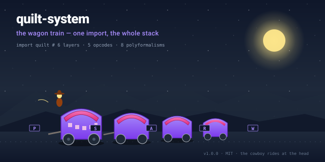

# quilt-system



> **Read This If You Are New**
> The Quilt is a stack of small, focused repos. `quilt-system` is the
> one that ties them together — install it once, and you have the
> substrate, the cowboy, the bus, the state, the picker, and the
> casting-call at a single `import`.

---

## 30-second TL;DR

`quilt-system` is the meta-package. It re-exports the public API of
every layer in the Quilt stack. If you want a single dependency that
gives you the whole polyformalism foundation plus its runtime
companions, this is the one.

| Opcode | What it does | Where it lives in the meta-package |
|--------|--------------|------------------------------------|
| **P**  | Pinch a context to a value (the forward map) | `quilt_system.foundation.Pinch` |
| **S**  | Saddle a value into a record (the inverse) | `quilt_system.foundation.Saddle` |
| **A**  | Advance the cowboy's clock one tick | `quilt_system.cowboy.advance` |
| **R**  | React: pub/sub on the bus, retire on completion | `quilt_system.bus.publish` |
| **W**  | Witness: persist state, hash-chain, remember | `quilt_system.state.commit` |

The stack is not a framework. It's a wagon train: every wagon is a
repo, every wagon is independently versioned, and the cowboy rides at
the head with a clock.

---

## 5-minute TL;DR

### Install

```bash
pip install quilt-system
# — or, for the whole development stack —
git clone https://github.com/SuperInstance/quilt-system.git
cd quilt-system
pip install -e .
```

`quilt-system` declares the rest of the polyformalism stack as
dependencies. One install, one version pin, one lockfile.

### Use the whole stack with one import

```python
import quilt

# Foundation — the 5 opcodes, the same in 4 languages
from quilt.foundation import Pinch, Saddle, Op, Inverse

# Runtime companions — the wagon train
substrate = quilt.Substrate()             # the 4D cell-graph
state     = quilt.StateManager("/var/lib/quilt")
bus       = quilt.EventBus()              # the nervous system
picker    = quilt.OpenerPicker()          # the view brain
casting   = quilt.QuiltCastingCallPlugin(substrate, probes=quilt.Probes(
              user="reyes", app="F/V EILEEN", weather="gale"))
cowboy    = quilt.Cowboy(state_dir="/var/lib/quilt/cowboy")

# A single tick of the cowboy's clock
def tick(ctx):
    value  = Op.run(ctx)                  # the forward map (P, S, …)
    record = Inverse.run(value)           # the inverse (S, W, …)
    bus.publish("tick", source="op", data={"v": value, "r": record})
    state.commit("tick.jsonl", record)    # atomic, hash-chained
    cowboy.advance(reason="tick")         # the cowboy rides

# Run it
tick({"q": "what is the depth at lat 44.2, lon -68.1?",
      "ctx": {"weather": "gale", "user": "reyes"}})
```

That `import quilt` is the whole point. You didn't import five
packages. You imported one. Under the hood, `quilt-system` re-exports
the public API of the five runtime companions plus the foundation
package — and the foundation is the same five opcodes re-implemented
in C, Rust, TypeScript, and Haskell. **One shape, four metals.**

### Use a single layer without the rest

```python
# Don't want the cowboy? Skip it.
from quilt.bus import EventBus
bus = EventBus()
bus.subscribe("wake", lambda e: print(e))
bus.publish("wake", source="alarm", data={"hour": 6})
```

Every layer is also a standalone package on PyPI
(`quilt-foundation`, `quilt-substrate`, `quilt-cowboy`, `quilt-bus`,
`quilt-state`, `quilt-picker`, `quilt-casting`). The meta-package is
the convenience; the individual repos are the contract.

---

## What is the meta-package, really? — the wagon train

Imagine a wagon train crossing a plain at dusk. Each wagon is a
self-contained household: it has its own canvas cover (the API), its
own wheels (the tests), its own cargo (the implementation), and its
own version stamped on the axle (the semver tag). Any wagon can
break from the train, circle back, or be replaced without the others
noticing.

But the train moves as one. There's a lead wagon with a cowboy on the
bench, a clock in his pocket, and a lasso out front. He doesn't drive
every wagon — he just keeps the pace. The wagon master (you) decides
which wagons go and in what order. The cowboy decides the clock.

That's `quilt-system`:

- The **wagons** are the small repos — foundation, substrate, cowboy,
  bus, state, picker, casting. Each is independently versioned,
  independently installable, independently testable.
- The **lead wagon** is the cowboy. The cowboy owns the clock and
  the morning ritual; everything else advances because he says so.
- The **train** is `quilt-system` — the meta-package that gives you
  all the wagons with one `import`, and a stable place to stand
  while you rearrange them.
- The **trail** is the polyformalism — the same five opcodes
  rendered in four metals (C, Rust, TypeScript, Haskell), the same
  eight polyformalisms, the same wagon train shape no matter what
  language you're writing in.

The metaphor is more than flavor. **A wagon train is not a
framework.** A framework is a single chassis that everyone rides in;
if the chassis cracks, everyone falls. A wagon train is a
*composition* of independent units that agree on a destination and a
pace. If one wagon breaks an axle, the others unhitch and circle
back. That's the Phase 5 split: stop riding a chassis, start driving
a train.

---

## The 6 layers it ties together

```
+----------------+     +----------------+     +----------------+
|  foundation    |     |  substrate     |     |  cowboy        |
|  (the 5 ops)   |     |  (the data)    |     |  (the clock)   |
+--------+-------+     +--------+-------+     +--------+-------+
         |                      |                      |
         | interprets           | renders              | advances
         v                      v                      v
+----------------+     +----------------+     +----------------+
|  bus           |     |  picker        |     |  state         |
|  (the nerve)   |     |  (the eye)     |     |  (the diary)   |
+----------------+     +----------------+     +----------------+
                                  |
                                  | decides
                                  v
                           +----------------+
                           |  casting       |
                           |  (the hand)    |
                           +----------------+
```

| # | Layer | Repo | Job | Versioned |
|---|-------|------|-----|-----------|
| 1 | **foundation** | [quilt-foundation](https://github.com/SuperInstance/quilt-foundation) | The 5 opcodes — P, S, A, R, W | `v0.1.0` |
| 2 | **substrate** | [quilt-substrate](https://github.com/SuperInstance/quilt-substrate) | 4D cell-graph, 13 openers, the data | `v4.0-cowboy-loop` |
| 3 | **cowboy** | [quilt-cowboy](https://github.com/SuperInstance/quilt-cowboy) | Reflection loop, morning ritual, the clock | `v1.0.0` |
| 4 | **bus** | [quilt-bus](https://github.com/SuperInstance/quilt-bus) | In-process pub/sub event bus, the nervous system | `v1.0.0` |
| 5 | **state** | [quilt-state](https://github.com/SuperInstance/quilt-state) | Atomic JSON/JSONL writes, schema versioning, the diary | `v1.0.0` |
| 6 | **picker / casting** | [quilt-picker](https://github.com/SuperInstance/quilt-picker), [quilt-casting](https://github.com/SuperInstance/quilt-casting) | Wilson + LinUCB model router, gale-aware | `v1.0.0` |

`quilt-system` is the harness. It depends on all six. You depend on
`quilt-system`. The chain is short and the trail is wide.

---

## A real-world example — `import quilt` pulls the whole stack

```python
"""examples/full_system.py — The Quilt as one import."""
import quilt                                # ← that's it, that's the line

# A. The foundation: the 5 opcodes, callable directly
ctx  = quilt.Pinch({"q": "bathy:0", "weather": "gale"})
val  = quilt.Op.P(ctx)                      # forward map
rec  = quilt.Inverse.S(val)                 # inverse map
diff = rec["answer"] - 4.2                  # the residue

# B. The runtime: the cowboy ticks, the bus publishes, the state commits
@quilt.bus.subscribe("tick")
def on_tick(event):
    if event["diff"] > 0.05:
        quilt.cowboy.retire(reason="anomaly", payload=event)
    quilt.state.append_jsonl("voyage.jsonl", event)

quilt.cowboy.morning_ritual(                # the cowboy's first breath
    state_dir="/var/lib/quilt",
    substrate=quilt.Substrate.load("/var/lib/quilt/substrate"),
)
quilt.cowboy.run(                           # ride forever
    on_tick=on_tick,
    cadence="1m",
    until=quilt.cowboy.at_dawn(),
)

# C. The casting-call: pick the right model for the right weather
decision = quilt.casting.decide(
    opener="tide",
    kwargs={"role": "sensory_creative"},
    probes=quilt.Probes(user="reyes", app="F/V EILEEN", weather="gale"),
)
print(decision.model, decision.rationale)
```

Read it top to bottom. There's no framework code, no router
configuration, no DI container, no plugin registry. There is one
import, six objects, and a cowboy. **The composition is the value.**

A runnable copy lives at
[`examples/full_system.py`](https://github.com/SuperInstance/quilt-system/blob/master/examples/full_system.py).

---

## How this fits the polyformalism

The polyformalism is a single architectural shape — *a function from
context to value with an inverse, advanced by a clock* — expressed in
many languages. `quilt-system` is the seam that proves the shape
holds.

The 16 polyformalism repos, grouped by role:

### The meta-package
- [quilt-system](https://github.com/SuperInstance/quilt-system) —
  this repo. The wagon train.

### The foundation in 4 metals
- [quilt-vm-c](https://github.com/SuperInstance/quilt-vm-c) — C99
  (`0.11ms`). Microcontrollers, OS kernels, the F/V EILEEN's tablet.
- [quilt-vm-rust](https://github.com/SuperInstance/quilt-vm-rust) —
  Rust (`~0.5ms`). Production servers, the cowboy's day job.
- [quilt-vm-typescript](https://github.com/SuperInstance/quilt-vm-typescript) —
  TypeScript (`~1ms`). Modern web, agents, Cordis-native.
- [quilt-vm-haskell](https://github.com/SuperInstance/quilt-vm-haskell) —
  Haskell. Algebraic foundation, paper writers.
- [quilt-vm-wasm](https://github.com/SuperInstance/quilt-vm-wasm) —
  WebAssembly. Browser, edge, sandboxed embed.
- [quilt-types](https://github.com/SuperInstance/quilt-types) — shared
  type signatures across all four metals.
- [quilt-linker](https://github.com/SuperInstance/quilt-linker) —
  the linker between metals; the same 5 opcodes ↔ the same 5 opcodes.
- [quilt-opt](https://github.com/SuperInstance/quilt-opt) — the
  optimizer; the one place where the polyformalism gets to argue with
  itself about what a forward map *should* be.
- [quilt-gc](https://github.com/SuperInstance/quilt-gc) — garbage
  collection for the cell-graph; the memory of the cowboy.

### The runtime in Python
- [quilt-foundation](https://github.com/SuperInstance/quilt-foundation) —
  the 5-opcode VM, foundation for all polyformalisms.
- [quilt-substrate](https://github.com/SuperInstance/quilt-substrate) —
  4D cell-graph with 13 openers.
- [quilt-state](https://github.com/SuperInstance/quilt-state) —
  atomic JSON/JSONL writes, schema versioning.
- [quilt-bus](https://github.com/SuperInstance/quilt-bus) — the
  in-process pub/sub event bus.
- [quilt-cowboy](https://github.com/SuperInstance/quilt-cowboy) —
  reflection loop, morning ritual, real-time reactor.
- [quilt-picker](https://github.com/SuperInstance/quilt-picker) —
  learned opener selection.
- [quilt-casting](https://github.com/SuperInstance/quilt-casting) —
  Wilson + LinUCB model router.
- [quilt-cordis](https://github.com/SuperInstance/quilt-cordis) —
  the bridge: Quilt cells ≡ Cordis plugins.
- [quilt-polyformalism-dsl](https://github.com/SuperInstance/quilt-polyformalism-dsl) —
  the domain-specific language for stating polyformalism programs.
- [quilt-ecosystem-demo](https://github.com/SuperInstance/quilt-ecosystem-demo) —
  end-to-end demo: the whole stack, working, on one screen.

`quilt-system` is the only repo on the list that depends on *all* the
others. That's what "meta" means here: it doesn't add new opcodes, it
adds **a single import that proves the polyformalism fits together**.

---

## The Cowboy Says

*The unit of architectural foundation is the opcode, not the
framework. The 5 opcodes host 8 polyformalisms. The polyformalisms
are one thing in N languages. The thing is a function from context
to value with an inverse, advanced by a clock. The clock is the
cowboy. The cowboy is the rider.*

`quilt-system` is the rider's saddle. You don't wear a saddle
because you love leather; you wear it because you've got cattle to
move. The opcodes are the cattle. The cowboy is the clock. The wagon
train is the body that carries them all.

Install the meta-package and you've bought a saddle, a horse, and a
trail. Pick a wagon. Pick a destination. Let the cowboy keep the
pace. **The composition is the value.**

---

## Tests

```bash
git clone https://github.com/SuperInstance/quilt-system.git
cd quilt-system
pip install -e .[dev]
pytest -q
```

The test suite asserts that the meta-package's re-exports match the
upstream public APIs of every layered repo. If a layer changes its
public surface, the meta-package's tests fail in CI *before* a
release — that's the lock that keeps the train honest.

A runnable smoke test is at
[`examples/full_system.py`](https://github.com/SuperInstance/quilt-system/blob/master/examples/full_system.py).
It imports all six layers, runs one cowboy tick, and prints
`"Each piece has one job. The composition is the value."`

---

## API

The full public surface is the union of the public surfaces of the
six layered repos, re-exported under `quilt.*` (preferred) and
`quilt_system.*` (legacy). Browse the per-layer docs:

- **Foundation (the 5 opcodes):** see
  [quilt-foundation](https://github.com/SuperInstance/quilt-foundation)
- **Substrate (the cell-graph):** see
  [quilt-substrate](https://github.com/SuperInstance/quilt-substrate)
- **Cowboy (the clock):** see
  [quilt-cowboy](https://github.com/SuperInstance/quilt-cowboy)
- **Bus (the nervous system):** see
  [quilt-bus](https://github.com/SuperInstance/quilt-bus)
- **State (the diary):** see
  [quilt-state](https://github.com/SuperInstance/quilt-state)
- **Picker / Casting (the eye and the hand):** see
  [quilt-picker](https://github.com/SuperInstance/quilt-picker) and
  [quilt-casting](https://github.com/SuperInstance/quilt-casting)

The legacy `quilt_system.*` namespace re-exports the same symbols for
backward compatibility. New code should prefer `quilt.*`.

---

## Learn More

- **The polyformalism manifesto** — the five-opcode shape, stated
  formally. (See [quilt-polyformalism-dsl](https://github.com/SuperInstance/quilt-polyformalism-dsl).)
- **The end-to-end demo** — the whole stack, working, in one
  repo: [quilt-ecosystem-demo](https://github.com/SuperInstance/quilt-ecosystem-demo).
- **The substrate trainer** — how the substrate learns to pick the
  right opener: [substrate-trainer](https://github.com/SuperInstance/substrate-trainer).
- **The river of dreams** — the persistent log the cowboy writes
  into: [river-dream-log](https://github.com/SuperInstance/river-dream-log).
- **The porch** — the entry point for new agents:
  [porch](https://github.com/SuperInstance/porch).
- **The bathy** — depth measurements from the F/V EILEEN's nets:
  [quilt-bathy](https://github.com/SuperInstance/quilt-bathy).
- **The cell runtime** — the runtime underneath the cell graph:
  [cell-runtime](https://github.com/SuperInstance/cell-runtime).
- **The saddle bridge** — the ledger between substrate and
  cowboy: [quilt-saddle-bridge](https://github.com/SuperInstance/quilt-saddle-bridge).

---

## Versioning

Each layered repo is versioned independently under semantic
versioning. `quilt-system` declares a *range* for each dependency
(e.g. `quilt-cowboy>=1.0.0,<2.0.0`). Pin the meta-package in your
lockfile, and every wagon is pinned with it.

When you upgrade a wagon, run the meta-package's tests. If the
re-exports drift, the tests catch it before your service does.

---

## License

MIT — same as the rest of the Quilt. See each layered repo for
details and contributor credits.

---

## Author

[SuperInstance](https://github.com/SuperInstance) — and the cowboy,
who keeps the pace.


---

## Roaming the Quilt collection

You came through the **meta-package**. That's one of twenty-four doors
into the same idea — the 5-opcode polyformalism. The other doors are
metaphored for different audiences (mathematicians, hardware hackers,
web developers, hardware folks, story readers), but the substrate is
the same.

**The full map of the collection:** [COLLECTION.md](https://github.com/SuperInstance/AI-Writings/blob/master/seed-canon/COLLECTION.md)

**From here, three wander-paths you might enjoy:**

1. **[quilt-foundation](https://github.com/SuperInstance/quilt-foundation)** — the foundational doc that ties everything together
2. **[quilt-substrate-meta](https://github.com/SuperInstance/quilt-substrate-meta)** — the C99 self-evolving core of the system
3. **[quilt-bus](https://github.com/SuperInstance/quilt-bus)** — the pub/sub that runs on this substrate

The cowboy's maxim: *The unit of foundation is the cell, not the
opcode. The 5 opcodes are the 5 messages a cell can receive. The 24
repos are the 24 doors into the same message. The cowboy is the one
who wanders.*
